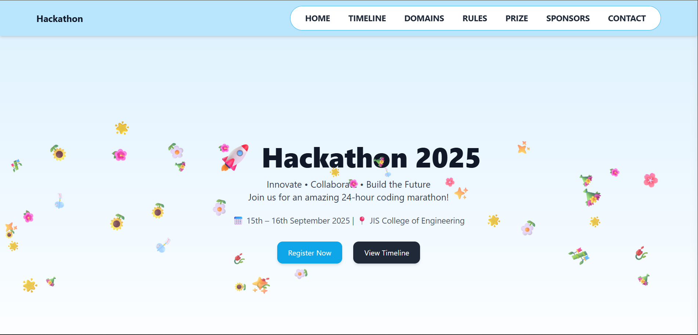

# Hackathon Upload Website

 <!-- replace with your uploaded image path -->

This is a **React + Vite** project for a Hackathon event website.  
It includes sections like Home, Timeline, Domains, Rules, Prize, Sponsors, Coordinators, Contact, and fun UI effects like **falling flowers and jhunri**. Tailwind CSS is used for styling, and ESLint is configured for code quality.

---

## Table of Contents

- [Features](#features)
- [Project Structure](#project-structure)
- [Setup & Installation](#setup--installation)
- [Running the Project](#running-the-project)
- [Tailwind CSS Setup](#tailwind-css-setup)
- [ESLint Configuration](#eslint-configuration)
- [Components Overview](#components-overview)
- [Google Form Integration](#google-form-integration)

---

## Features

- Sticky **header** with desktop and mobile hamburger menu.
- Sections: **Home, Timeline, Domains, Rules, Prize, Sponsors, Coordinators, Contact**.
- Animated **falling flowers & jhunri** across the page.
- **Google Form** registration.
- Smooth scrolling to anchors.
- Fully responsive design.
- Tailwind CSS for modern styling.

---

## Project Structure


src/
├─ Components/
│ ├─ Header.jsx
│ ├─ Home.jsx
│ ├─ Timeline.jsx
│ ├─ Domains.jsx
│ ├─ Rule.jsx
│ ├─ Prize.jsx
│ ├─ Sponsars.jsx
│ ├─ Contact.jsx
│ ├─ FallingFlowers.jsx
├─ App.jsx
├─ main.jsx
├─ index.css

## Setup & Installation

1. Clone the repository:

```bash
git clone https://github.com/yourusername/hackathon-upload.git
cd hackathon-upload

npm install

npm install -D tailwindcss postcss autoprefixer
npx tailwindcss init

npm install -D eslint eslint-plugin-react eslint-plugin-react-hooks
npm install react-icons
npm run dev
